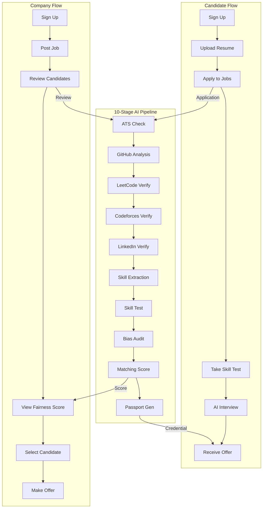

# Fair Hiring Network (FHN)

**AI-Driven Skill Verification & Fairness Protocol**

[](LICENSE)
[](https://www.python.org/)
[](https://fastapi.tiangolo.com/)
[](https://react.dev/)
[](https://zynd.ai/)

---

## Overview

The **Fair Hiring Network (FHN)** is a next-generation hiring platform that leverages **Zynd AI** and **Google Gemini** to create a decentralized, transparent, and bias-free recruitment ecosystem. By utilizing a constellation of specialized AI agents, FHN verifies technical skills, audits for bias, and matches candidates based on verified evidence rather than just resumes.

---

## Key Features

- **Bias Detection** - AI-powered analysis of job descriptions to eliminate gender, college, and demographic biases
- **Skill Verification** - Multi-source verification through GitHub, LeetCode, Codeforces, and LinkedIn
- **Resume Fraud Detection** - ATS-style checks for authenticity verification
- **Evidence-Based Matching** - Match candidates to jobs using verified evidence, not just resumes
- **Cryptographic Credentials** -  skill passports with cryptographic signatures
- **AI Interviews** - Real-time video interviews with AI evaluation powered by Google Gemini

---

## System Architecture

### High-Level Architecture (ASCII)

```
┌─────────────────────────────────────────────────────────────────────────────────────┐
│                                     FAIR HIRING NETWORK                              │
├─────────────────────────────────────────────────────────────────────────────────────┤
│                                                                                     │
│  ┌─────────────────────────────────────────────────────────────────────────────┐   │
│  │                              PRESENTATION LAYER                              │   │
│  │  ┌─────────────────────────────────────┐  ┌─────────────────────────────┐  │   │
│  │  │     React Dashboard (Vite)         │  │   Auth0 Authentication      │  │   │
│  │  │  • Landing Page with 3D Scene       │  │   • Candidate Login         │  │   │
│  │  │  • Company Dashboard                │  │   • Company Login           │  │   │
│  │  │  • Candidate Portal                 │  │   • OAuth2/OIDC             │  │   │
│  │  │  • AI Protocall Interview           │  └─────────────────────────────┘  │   │
│  │  │  • Skill Passport Viewer            │                                    │   │
│  │  └─────────────────────────────────────┘                                    │   │
│  └─────────────────────────────────────────────────────────────────────────────┘   │
│                                         │                                          │
│                                         ▼                                          │
│  ┌─────────────────────────────────────────────────────────────────────────────┐   │
│  │                               API GATEWAY                                    │   │
│  │  ┌──────────────────────────────────────────────────────────────────────┐   │   │
│  │  │                        FastAPI Backend (Port 8010)                  │   │   │
│  │  │  • RESTful API Endpoints      • JWT Authentication                 │   │   │
│  │  │  • Request Validation          • CORS Configuration                │   │   │
│  │  │  • Pipeline Orchestration      • Database Connection Pooling       │   │   │
│  │  └──────────────────────────────────────────────────────────────────────┘   │   │
│  └─────────────────────────────────────────────────────────────────────────────┘   │
│                                         │                                          │
│           ┌─────────────────────────────┼─────────────────────────────┐          │
│           ▼                             ▼                             ▼          │
│  ┌─────────────────┐      ┌─────────────────────┐      ┌──────────────────┐     │
│  │  Zynd Orchestrator │      │   External Services  │      │   PostgreSQL DB   │     │
│  │    (Port 5100)    │      │                       │      │   (Port 5432)     │     │
│  ├─────────────────┤      ├───────────────────────┤      ├──────────────────┤     │
│  │ Agent Discovery  │      │ • Google Gemini 2.0   │      │ • companies      │     │
│  │ Capability Map   │      │ • ElevenLabs TTS     │      │ • candidates     │     │
│  │ Sync Webhooks    │      │ • Ollama (Local LLM)  │      │ • jobs           │     │
│  └────────┬────────┘      │ • Auth0 (Auth)        │      │ • applications   │     │
│           │               └───────────────────────┘      │ • credentials    │     │
│           │                                                 │ • agent_runs     │     │
│           ▼                                                 │ • review_cases   │     │
│  ┌─────────────────────────────────────────────────────────────────────────────┐   │
│  │                           AGENT CONSTELLATION (9 Agents)                    │   │
│  ├──────────┬──────────┬──────────┬──────────┬──────────┬──────────┬──────────┤   │
│  │  ATS     │  Skill   │  GitHub  │  Bias    │ Matching │ Passport │ LinkedIn │   │
│  │  Agent   │  Agent   │  Agent   │  Agent   │  Agent   │  Agent   │  Agent   │   │
│  │  (8004)  │  (8003)  │  (8005)  │  (8002)  │  (8001)  │  (8008)  │  (8007)  │   │
│  ├──────────┴──────────┴──────────┴──────────┴──────────┴──────────┴──────────┤   │
│  │  LeetCode    │  Codeforces  │                                                    │
│  │  Agent       │  Agent        │                                                    │
│  │  (8006)      │  (8011)      │                                                    │
│  └──────────────┴───────────────┘                                                    │
│  └─────────────────────────────────────────────────────────────────────────────┘   │
└─────────────────────────────────────────────────────────────────────────────────────┘
```

### System Flow Diagram (Mermaid)



### Data Flow Table

| Stage | Agent | Input | Output | Verification | Documentation |
|-------|-------|-------|--------|--------------|---------------|
| 1 | ATS Agent | Resume, Application | Fraud Score, Blacklist Status | Resume authenticity | No separate README - part of [Skill Verification](./agents_files/Clean_Hiring_System/skill_verification_agent/README.md) |
| 2 | GitHub Agent | GitHub Username | Repo Analysis, Code Quality | Code contributions | No separate README - part of [Skill Verification](./agents_files/Clean_Hiring_System/skill_verification_agent/README.md) |
| 3 | LeetCode Agent | LeetCode Username | Problems Solved, Rating | Algorithm skills | No separate README - part of [Skill Verification](./agents_files/Clean_Hiring_System/skill_verification_agent/README.md) |
| 4 | Codeforces Agent | Codeforces Username | Rating, Contest History | Competitive coding | No separate README - part of [Skill Verification](./agents_files/Clean_Hiring_System/skill_verification_agent/README.md) |
| 5 | LinkedIn Agent | LinkedIn URL | Profile Verification | Work history | No separate README - part of [Skill Verification](./agents_files/Clean_Hiring_System/skill_verification_agent/README.md) |
| 6 | [Skill Agent](./agents_files/Clean_Hiring_System/skill_verification_agent/README.md) | Resume + Profiles | Skill Taxonomy | Evidence graph | [Skill README](./agents_files/Clean_Hiring_System/skill_verification_agent/README.md) |
| 7 | Test Agent | Skill Areas | Test Results | Practical skills | [Test Agent README](./agents_services/test_agent_README.md) |
| 8 | [Bias Agent](./agents_files/Clean_Hiring_System/bias_detection_agent/README.md) | Job Description | Bias Report | Fairness score | [Bias README](./agents_files/Clean_Hiring_System/bias_detection_agent/README.md) |
| 9 | [Matching Agent](./agents_files/Clean_Hiring_System/matching_agent/README.md) | Candidate + Job | Match Score | Evidence-based | [Matching README](./agents_files/Clean_Hiring_System/matching_agent/README.md) |
| 10 | [Passport Agent](./agents_files/Clean_Hiring_System/passport_agent/README.md) | All Evidence | Signed Credential | Cryptographic | [Passport README](./agents_files/Clean_Hiring_System/passport_agent/README.md) |

---

## The 9 Zynd Agents

| # | Agent | DID | Port | Purpose |
|---|-------|-----|------|---------|
| 1 | **ATS Agent** | `did:zynd:0xATS` | 8004 | Resume fraud detection, blacklist checking, policy gating |
| 2 | **Skill Agent** | `did:zynd:0xSKILL` | 8003 | Skill extraction from resumes + profiles with confidence scores |
| 3 | **GitHub Agent** | `did:zynd:0xGITHUB` | 8005 | Repository analysis, code quality metrics, contribution verification |
| 4 | **Bias Agent** | `did:zynd:0xBIAS` | 8002 | Gender & college bias detection, fairness eligibility determination |
| 5 | **Matching Agent** | `did:zynd:0xMATCHING` | 8001 | Evidence-based candidate-job matching with scoring |
| 6 | **Passport Agent** | `did:zynd:0xPASSPORT` | 8008 | Cryptographic credential generation and signing |
| 7 | **LinkedIn Agent** | `did:zynd:0xLINKEDIN` | 8007 | Professional history verification, profile authenticity |
| 8 | **LeetCode Agent** | `did:zynd:0xLEETCODE` | 8006 | Algorithm problem-solving verification, rating calculation |
| 9 | **Codeforces Agent** | `did:zynd:0xCODEFORCES` | 8011 | Competitive programming verification, contest performance |

---

## Tech Stack

### Frontend

| Technology | Version | Purpose |
|------------|---------|---------|
| React | 18.3.1 | UI Framework |
| Vite | 6.0.3 | Build Tool |
| Tailwind CSS | 3.4.17 | Styling |
| Framer Motion | 12.29.0 | Animations |
| GSAP | 3.12.5 | Advanced Animations |
| Three.js | 0.170.0 | 3D Graphics |
| Lenis | 1.1.18 | Smooth Scroll |
| Auth0 | 2.15.0 | Authentication |
| Google Generative AI | 0.24.1 | AI Integration |
| Recharts | 3.7.0 | Data Visualization |
| React Router | 7.13.0 | Routing |

### Backend

| Technology | Version | Purpose |
|------------|---------|---------|
| Python | 3.10+ | Runtime |
| FastAPI | 0.109+ | Web Framework |
| SQLAlchemy | 2.0+ | ORM |
| asyncpg | 0.29+ | PostgreSQL Driver |
| Pydantic | 2.5+ | Validation |
| Uvicorn | 0.27+ | ASGI Server |
| Zynd SDK | 0.1.0 | Agent Orchestration |

### AI/ML Services

| Service | Purpose |
|---------|---------|
| Google Gemini 2.0 Flash | LLM for code/resume analysis |
| Ollama | Local LLM for verification |
| Auth0 | Identity management |

---

## Quick Start

### Prerequisites

- **Python 3.10+** with virtual environment
- **Node.js 18+**
- **PostgreSQL** (configured in `.env`)
- **Ollama** (optional, for local LLM)
- **API Keys**: Auth0, ElevenLabs, Google Gemini

### Launch Backend & Agents

Run the following from the root directory to launch the FastAPI backend and all 9 Zynd agents:

```powershell
.\start_demo.ps1
```

### Launch Frontend

In a **separate** terminal, run the React dashboard:

```powershell
cd fair-hiring-frontend
npm install
npm run dev
```

Access the dashboard at [http://localhost:5173](http://localhost:5173)

---

## Project Structure

```
HEUREKA_ACEHACK/
├── backend/                     # FastAPI Backend
│   ├── app/
│   │   ├── agents/              # Local agent implementations
│   │   ├── routers/             # API endpoints
│   │   ├── services/            # Business logic
│   │   ├── models_new.py        # Database models
│   │   ├── schemas_new.py       # Pydantic schemas
│   │   ├── main.py              # Application entry
│   │   ├── zynd_orchestrator.py # Zynd SDK integration
│   │   └── agent_client.py      # Agent communication
│   ├── alembic/                 # Database migrations
│   ├── data/                    # Sample data
│   ├── requirements.txt         # Python dependencies
│   └── README.md                # Backend documentation
│
├── fair-hiring-frontend/         # React Dashboard
│   ├── src/
│   │   ├── api/                 # Backend API client
│   │   ├── auth/                # Auth0 integration
│   │   ├── components/           # UI components
│   │   ├── pages/               # Route pages
│   │   └── services/            # Frontend services
│   ├── package.json
│   └── README.md                # Frontend documentation
│
├── agents_services/              # Agent Microservices
│   ├── ats_service.py           # ATS Agent
│   ├── bias_agent_service.py   # Bias Agent
│   ├── matching_agent_service.py
│   ├── skill_agent_service.py
│   ├── passport_agent_service.py
│   ├── github_service.py
│   ├── linkedin_service.py
│   ├── leetcode_service.py
│   ├── codeforce_service.py
│   └── start_all.py             # Launch all agents
│
├── agents_files/
│   └── Clean_Hiring_System/    # Core agent implementations
│       ├── bias_detection_agent/
│       ├── matching_agent/
│       ├── passport_agent/
│       ├── skill_verification_agent/
│       └── ...
│
├── zynd_integration/             # Zynd SDK Integration
│   └── agents/                   # Zynd webhook agents
│
├── start_demo.ps1                # Main demo launcher
├── start_backend.ps1            # Backend launcher
├── start_frontend.ps1            # Frontend launcher
└── start_zynd_agents.ps1        # Agent launcher
```

---

## Architecture Decisions

### Why FastAPI?
- Native async support for high concurrency
- Automatic OpenAPI documentation
- Type safety with Pydantic
- Fast startup and low memory footprint

### Why React + Vite?
- Fast HMR for rapid development
- Tree-shaking for smaller bundles
- Rich ecosystem for animations (Framer Motion, GSAP)
- Three.js integration for immersive 3D experiences

### Why Zynd Agents?
- Decentralized agent network
- Capability-based discovery
- Synchronous webhook communication
- Agent DID for verification

### Why PostgreSQL?
- ACID compliance for data integrity
- JSON support for flexible schemas
- Connection pooling for scale
- Mature ecosystem with migrations

---

## Security & Compliance

- **Authentication**: OAuth2/OIDC via Auth0
- **Authorization**: JWT tokens with role-based access
- **Data Encryption**: TLS in transit, encrypted DB fields
- **API Security**: Rate limiting, CORS policies
- **Audit Trail**: All agent runs logged with input/output

---

## API Documentation

Full API documentation is available at:
- Swagger UI: [http://localhost:8010/docs](http://localhost:8010/docs)
- ReDoc: [http://localhost:8010/redoc](http://localhost:8010/redoc)

### Main Endpoints

| Endpoint | Method | Description |
|----------|--------|-------------|
| `/api/auth/*` | POST | Authentication |
| `/api/candidate/*` | GET/POST | Candidate management |
| `/api/company/*` | GET/POST | Company management |
| `/api/jobs/*` | GET/POST | Job postings |
| `/api/applications/*` | GET/POST | Applications |
| `/api/pipeline/run` | POST | Run hiring pipeline |
| `/api/pipeline/status/*` | GET | Pipeline status |
| `/api/passport/*` | GET | Skill passport |

---

## Contributing

1. Fork the repository
2. Create a feature branch (`git checkout -b feature/amazing-feature`)
3. Commit your changes (`git commit -m 'Add amazing feature'`)
4. Push to the branch (`git push origin feature/amazing-feature`)
5. Open a Pull Request

---

## License

This project is licensed under the **MIT License**. See the [LICENSE](LICENSE) file for details.

---

## Support

For issues and questions:
- Open an issue on GitHub
- Check the documentation in each component's README
- Review the API documentation at `/docs`

---

