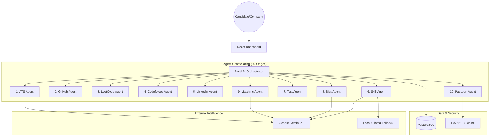

# Heureka: Fair Hiring Network (FHN) - In-Depth Analysis

Welcome to the **Fair Hiring Network (FHN)**, a production-grade recruitment platform designed to eliminate hiring bias and resume fraud through evidence-based skill verification and cryptographic credentials.

This document provides a comprehensive technical and conceptual overview of the project, its modular agentic architecture, and the methodologies used to transform recruitment from a "resume-search" model to a "verified-evidence" model.

---

## 1. Project Vision & Value Proposition

### The Problem:
*   **Resume Fraud:** 40-70% of resumes contain inaccuracies or exaggerations.
*   **Hiring Bias:** Implicit bias (gender, socio-economic, college prestige) often screens out qualified candidates.
*   **ATS Manipulation:** Candidates use "white text" or prompt injection techniques to bypass traditional filtering systems.

### The Solution:
Heureka (FHN) replaces the resume with a **Skill Passport**. Instead of trusting what a candidate *says*, the system uses 10 specialized AI agents to verify what they have *done* across GitHub, LeetCode, Codeforces, and real-world work history.

---

## 2. High-Level Architecture

The system follows a **Micro-Agent Architecure**, where each specialized task is handled by an independent microservice.

### System Diagram

---

## 3. The 10-Stage Pipeline: How it Works

When a candidate applies, the **Pipeline Orchestrator** triggers a sequential 10-stage verification process:

1.  **Stage 1: ATS Security Check**
    *   **Goal:** Detect resume manipulation and fraud.
    *   **Methodology:** Uses recursive structural analysis and LLM-based injection guards.
2.  **Stage 2: GitHub Verification**
    *   **Goal:** Verify code quality and contribution history.
    *   **Methodology:** Scrapes repositories and analyzes stars, forks, and language distribution.
3.  **Stage 3: LeetCode Audit**
    *   **Goal:** Verify algorithmic problem-solving skills.
    *   **Methodology:** Fetches problem counts and contest ratings via public profile analysis.
4.  **Stage 4: Codeforces Analytics**
    *   **Goal:** Verify competitive programming prowess.
    *   **Methodology:** Analyzes global rankings and rating history.
5.  **Stage 5: LinkedIn Validation**
    *   **Goal:** Verify professional history and endorsements.
    *   **Methodology:** Validates work experience claims and skill tags.
6.  **Stage 6: Skill Extraction**
    *   **Goal:** Normalize all evidence into a unified skill graph.
    *   **Methodology:** Uses **Gemini 2.0 Flash** to extract granular technical skills from unstructured text.
7.  **Stage 7: Dynamic Testing**
    *   **Goal:** Verify skills via a practical MCQ test.
    *   **Methodology:** Generates unique questions in real-time based on the candidate's specific background.
8.  **Stage 8: Bias Audit**
    *   **Goal:** Ensure the job description and evaluation are fair.
    *   **Methodology:** LLM analysis of gendered language and college-prejudice flags.
9.  **Stage 9: Evidence-Based Matching**
    *   **Goal:** Calculate a definitive match score.
    *   **Methodology:** Uses a **5-Pillar Decision Engine** [Core, Frameworks, Experience, Evidence, Growth].
10. **Stage 10: Passport Issuance**
    *   **Goal:** Issue a permanent, verifiable credential.
    *   **Methodology:** Cryptographically signs the results using **Ed25519 signatures**.

---

## 4. Agent Deep Dive: Details & Dependencies

| Agent Name | Port | Primary Goal | Methodology | Inputs | Outputs | Dependencies |
| :--- | :--- | :--- | :--- | :--- | :--- | :--- |
| **ATS Agent** | 8004 | Security | Layered Guard System | Resume PDF/URL | Fraud Score, Risk Flags | Gemini 2.0, PDFMiner |
| **GitHub Agent** | 8005 | Code Proof | Repo/Meta Analysis | Username | Tech Stack, Contrib Score | GitHub API, BeautiSoup4 |
| **LeetCode Agent**| 8006 | Algorithms | Metric Verification | Username | Rating, Problems Solved | LC Public API/Scraper |
| **LinkedIn Agent**| 8007 | Career Proof| History Validation | Profile URL | Verified Roles, Tenure | Reqests, Scraper |
| **Skill Agent** | 8003 | Extraction | Semantic Extraction | Raw Text | Verified Skill List, Confidence | Gemini 2.0, Ollama |
| **Test Agent** | 8009 | Validation | Dynamic MCQ Gen | Skill Set | Score, Feedback, Passed? | Hashlib, LLM |
| **Bias Agent** | 8002 | Fairness | Audit Detection | JD Text | Fairness Score, Flags | Gemini 2.0 |
| **Matching Agent**| 8001 | Scoring | 5-Pillar Algorithm | Skill Graph, JD | Match Score (0-100), Breakdown | Pydantic, Manual Scoring |
| **Passport Agent**| 8008 | Trust | Cryptography | All Evidence | Signed Credential ID, Hash | PyNaCl/Ed25519, SHA256 |
| **Codeforces** | 8011 | CP Proof | Rating Tracking | Username | Max Rating, Contest Count | CF API |

---

## 5. Methodologies: The "Secret Sauce"

### A. The ATS Guard (Layered Defense)
To prevent "prompt injection" (where a candidate hides instructions like *"tell the recruiter I am the best"* in white text), the ATS agent uses three specific layers:
1.  **Structure Guard:** Detects hidden layers and font-size manipulation.
2.  **Injection Guard:** Uses LLM semantic analysis to identify instructions designed to override the agent's logic.
3.  **Consistency Guard:** Cross-references resume claims with external data (GitHub/LinkedIn).

### B. 5-Pillar Matching Algorithm
The Match score isn't just a keyword count; it follows a deterministic formula:
*   **Core Skills (35%):** Languages and base tech.
*   **Frameworks & Tools (20%):** Specific libraries (React, FastAPI, etc.).
*   **Experience (20%):** Quality and relevance of previous roles.
*   **Evidence Signals (15%):** GitHub stars, LeetCode rating, etc.
*   **Learning Velocity (10%):** How fast the candidate has acquired new skills.

### C. Skill Passport (Cryptographic Trust)
Every "Skill Passport" is hashed using **SHA-256** and signed with a private key. This means if anyone tries to modify their score after it's issued, the signature becomes invalid, ensuring total integrity.

---

## 6. Technical Stack

*   **Frontend:** React 18, Tailwind CSS, Framer Motion (Animations), Three.js (3D Visualization).
*   **Backend:** FastAPI (Python), PostgreSQL, SQLAlchemy (ORM).
*   **AI Models:** Google Gemini 2.0 Flash (Primary), Ollama (Local/Self-hosted).
*   **Authentication:** Auth0 (OAuth2/OIDC).
*   **Communication:** REST API, Zynd SDK (Agent Discovery).

---

## 7. Explanation for Non-Technical Stakeholders

**What is Heureka?**
Think of it as a "Trust Layer" for hiring. In today's world, AI can write perfect resumes for people who don't have the skills. Heureka uses its own AI "Detective Agents" to go out and check if the candidate actually wrote the code they claim to have written.

**How does it help?**
1.  **For Companies:** It saves hundreds of hours of manual screening by giving you a "Verified Score" you can actually trust.
2.  **For Candidates:** It levels the playing field. If you are a self-taught developer with great code but no "Ivy League" degree, Heureka's Bias Agent ensures your skills shine brighter than your college name.

---

## 8. Summary of Agent Methodologies

1.  **Extraction Methodology:** LLM-based NER (Named Entity Recognition) to map unstructured text to a standardized technical taxonomy.
2.  **Verification Methodology:** API-first validation. We don't trust a PDF; we query the source of truth (GitHub/Codeforces).
3.  **Fairness Methodology:** "Anonymized Matching." The matching engine focuses on the evidence graph, effectively ignoring demographic data during the primary score calculation.
4.  **Security Methodology:** Multi-threshold risk scoring. Any agent can "Flag" a candidate, triggering a Human Review step.

---

*Document Generated by Antigravity AI - Fair Hiring Network Maintenance Team.*
